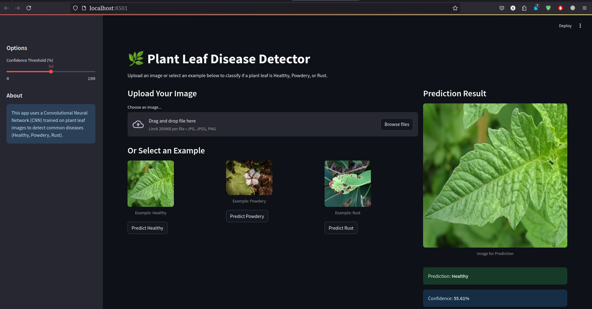

# 🌿 Plant Leaf Disease Detector

[](https://opensource.org/licenses/Apache-2.0)

A machine learning application built with TensorFlow/Keras and Streamlit to classify plant leaf diseases (Healthy, Powdery Mildew, Rust) from images.

## Overview

This project aims to assist in the early detection of common plant diseases by analyzing images of plant leaves. It utilizes a Convolutional Neural Network (CNN) trained on a dataset of leaf images to predict whether a leaf is healthy or affected by Powdery Mildew or Rust.

The application provides an interactive web interface built with Streamlit for easy image uploading and prediction.

## Features

*   **Disease Classification:** Identifies three conditions: Healthy, Powdery, Rust.
*   **Image Upload:** Allows users to upload JPG, JPEG, or PNG images of plant leaves.
*   **Example Images:** Provides sample images for each class that users can test the model with directly from the UI.
*   **Confidence Score:** Displays the model's confidence level for each prediction.
*   **Confidence Threshold:** Users can set a minimum confidence threshold in the sidebar to filter uncertain predictions.
*   **Interactive Web UI:** Built with Streamlit for easy use.
*   **Jupyter Notebook:** Includes the notebook (`plant-leaf-disease-detector.ipynb`) detailing data loading, preprocessing, augmentation, model training, and evaluation steps.

## Technology Stack

*   **Backend:** Python
*   **ML Framework:** TensorFlow / Keras
*   **Web Framework:** Streamlit
*   **Core Libraries:** NumPy, Pillow (PIL), Matplotlib
*   **Notebook:** Jupyter

## Dataset

The model was trained on images sourced from Kaggle. You can find details about the specific datasets used in the Jupyter Notebook or potentially from the original source links if available.
*   **Initial Kaggle Source:** [Plant Leaf Disease Detector Input](https://www.kaggle.com/code/raheba/plant-leaf-disease-detector/input) (Note: Actual datasets used might vary based on project evolution, refer to the notebook for specifics).
*   **Classes:** Healthy, Powdery, Rust

## Setup and Installation

1.  **Clone the Repository:**
    ```bash
    git clone https://github.com/Csasaka19/Plant-Leaf-Disease-Detector
    cd Plant-Leaf-Disease-Detector
    ```

2.  **Create and Activate Virtual Environment:**
    ```bash
    python -m venv venv
    source venv/bin/activate  # On Windows use `venv\Scripts\activate`
    ```

3.  **Install Dependencies:**
    A `requirements.txt` file is recommended. If it doesn't exist, you can create one based on the imports or install manually:
    ```bash
    pip install tensorflow Pillow matplotlib numpy streamlit ipykernel jupyter
    # Add any other specific libraries used
    ```
    *If a `requirements.txt` file exists:*_ _
    ```bash
    pip install -r requirements.txt
    ```

4.  **Download Datasets (if needed for retraining):**
    Follow the links or instructions in the Jupyter Notebook (`plant-leaf-disease-detector.ipynb`) to obtain the necessary image datasets and place them in the correct directories (e.g., `Train`, `Test`, `Validation`).

5.  **Download Pre-trained Model (Optional):**
    If the pre-trained model (`./models/plant_disease_model.h5`) and class indices (`./index/class_indices.json`) are provided in the repository or elsewhere, ensure they are placed in the correct `./models/` and `./index/` directories respectively.

6.  **Prepare Example Images (Optional but Recommended):**
    Create a directory named `example_images` in the root folder. Place one sample image for each class (Healthy, Powdery, Rust) inside it (e.g., `example_images/Healthy.jpg`, `example_images/Powdery.png`, `example_images/Rust.jpeg`).

## Running the Application

There are two main ways to interact with the project:

1.  **Explore the Training Process (Jupyter Notebook):**
    *   Ensure you have installed `ipykernel` and set up the kernel for your virtual environment (see comments in the first cell of the notebook).
    *   Launch Jupyter Notebook:
        ```bash
        jupyter notebook plant-leaf-disease-detector.ipynb
        ```
    *   Run the cells sequentially to understand data handling and model training.

2.  **Run the Interactive Web UI (Streamlit):**
    *   Make sure your virtual environment is activated.
    *   Navigate to the project root directory.
    *   Run the Streamlit app:
        ```bash
        streamlit run app.py
        ```
    *   Open the local URL (usually `http://localhost:8501`) provided in your terminal in a web browser.
    *   Upload an image or click an example image button to get a prediction.

## Screenshots



*The web application interface allows users to upload images or select examples for disease detection.*

## Model Details

*   **Architecture:** Convolutional Neural Network (CNN). Specific layers and structure can be found in the `plant-leaf-disease-detector.ipynb` notebook.
*   **Saved Model:** The trained model is saved at `./models/plant_disease_model.h5`.
*   **Class Indices:** The mapping between model output indices and class names is stored in `./index/class_indices.json`.

## How to Contribute

Contributions are welcome! Here are ways you can help:

1.  **Report Bugs:** If you find an issue with the code or the application, please open an issue in the GitHub repository.
2.  **Suggest Enhancements:** Have ideas for new features or improvements? Open an issue to discuss them.
3.  **Improve Documentation:** Enhance the README or add more detailed comments in the code.
4.  **Add More Disease Classes:** Expand the dataset and retrain the model to recognize more types of plant diseases.
5.  **Improve Model Accuracy:** Experiment with different CNN architectures, hyperparameters, or training techniques.
6.  **Submit Pull Requests:**
    *   Fork the repository.
    *   Create a new branch (`git checkout -b feature/YourFeature` or `bugfix/YourBugFix`).
    *   Make your changes.
    *   Commit your changes (`git commit -m 'Add some feature'`).
    *   Push to the branch (`git push origin feature/YourFeature`).
    *   Open a Pull Request.

## License

This project is licensed under the Apache License 2.0 - see the [LICENSE](LICENSE) file for details.
